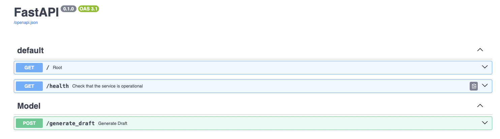

[](https://opensource.org/licenses/MIT)

## Content Generation Assistant 

This is a Content Generation Assistant that generates a draft for a given title/seed sentence/keywords and other parameters. Under the hood, it calls the API service deployed on GKE. The Flan-T5 model used here is not fine-tuned so, the result may not be very accurate.


## Details of implementation.

#### 1. API Development & Deployment:
- **Framework**:  The API is developed using the `FastAPI` framework.
- **Containerization**: The API is containerized using Docker and the image is stored in the Docker Hub registry.
- **Deployment**: Deployed on a Google Kubernetes Engine (GKE) cluster with CPU-based machines.
- **Replication**: Three replicas of the API running on the GKE cluster for high availability.
- **Region**: The API is deployed in the `eu-west` region in compliance with GDPR regulations.
- **Access & Authentication**: The public endpoint is exposed via Ingress with a fixed token authentication mechanism.

#### 2. Front-end Development:
- **Framework**: I am utilizing `Streamlit` for the front-end UI.
- **Containerization**: The Streamlit front-end is also containerized.
- **Deployment**: Like the API, it's deployed on the GKE cluster.
- **Interaction**: This UI interacts with our backend API to fetch and display results.

#### 3. Model Details:
- **Model Used**: I have used the `flan-T5 base` model with 250M parameters.
- **Fine-Tuning**: There's no fine-tuning done on the model.
- **Performance**: On CPU, the model's response time varies between 20-30 seconds depending on the word count.

#### 4. Current Limitations:
- **Vector DB Approach**: I am yet to implement the vector DB approach for prompt or context enrichment. Potential implementations could used managed services, Milvus, or the faiss index.

## How to run API locally?

To run the api, either:
Run from active Python environment using `uvicorn`:
```bash
pip install -r requirements.txt
uvicorn service.main:app --host 0.0.0.0 --port 8080 --reload
```

Or build and run the Docker container:
```bash
docker build -t vkd/content-assistant:1.0.0 .
docker run -p 8080:8080 --name content-assistant vkd/content-assistant:1.0.0
```

You should see something like on the terminal:
```bash
╰─ uvicorn service.main:app --host 0.0.0.0 --port 8080
INFO:     Started server process [16298]
INFO:     Waiting for application startup.
INFO:     Application startup complete.
INFO:     Uvicorn running on http://0.0.0.0:8080 (Press CTRL+C to quit)
```

Navigate to http://localhost:8080/docs to test the API.



Alternative, use `curl` 
```bash
curl -X 'POST' \
  'http://localhost:8080/generate_draft?token=cTAD1TIT7wYa6yK5KlayxLvv0WqIiHiRFEPZjPFdeVXSRqELeTt6iTUI5lC2AakW' \
  -H 'accept: application/json' \
  -H 'Content-Type: application/json' \
  -d '{
  "title": "Clean energy is a Danish passion",
  "tone": "Creative",
  "vertical": "Energy",
  "content_format": "Blogpost",
  "max_length": 1000,
  "min_length": 400
}'
```

The API responds with a greeting, and the result of a long-running calculation of the largest prime factor of a random integer. You should see a response body similar to:
```json
{
  "max_length": 1000,
  "min_length": 200,
  "prompt": "Title: \"Clean energy is a Danish passion\"\\nGiven the above title of an imaginary article, imagine the article.\\n \n    The article is for the business of Energy, and \n    the tone of the text should be Creative.\\n The generated content is to be used in Blogpost",
  "draft": "Copenhagen has found a niche in the energy markets but Denmark is still searching for a clean energy source. The energy sector has the key to that niche. There are many things that have led the energy sector to seek out a more natural source of energy than the fossil fuel sector. But Danish energy is more than just a car. The country's energy and water resources are under increasing pressure to meet energy needs. And Denmark isn't wasting any time to do so.'s energy efficiency.n What we do are a new energy system that makes power from fossil fuels.n That means Copenhagen doesn't just want to buy fossil fuel, it's going to invest in renewable resources. Its energy sector is about more than saving electricity. Denmark is going to invest in renewable energy. There is a chance that oil and gas is going to buy up carbon emissions in Denmark at a higher rate than the global average. A Danish citizen who wants to reduce energy bills is giving up his pension in Denmark, and that's something that he's passionate about.n So maybe our energy is not just a car, but an energy source as well. But why do the Danish want to drive our own cars? And if a car is made of oil and gas, he wants to drive his own car to Copenhagen?",
  "hostname": "local"
}
```
## How to run Streamlit demo locally?

In a new terminal, run the following:
```bash
cd streamlit_demo/
streamlit run streamlit.py
```

Or build and run the Docker container:
```bash
docker build -t vkd/content-assistant-ui:1.0.0 .
docker run -p 8080:8080 --name content-assistant-ui vkd/content-assistant-ui:1.0.0
```

You should see something like on the terminal:
```bash
╰─ streamlit run streamlit.py               

  You can now view your Streamlit app in your browser.

  Local URL: http://localhost:8501
  Network URL: http://192.168.1.29:8501
```

NOTE: There is a password protection on streamlit demo:
```bash
username: vkd
password: test1234
```


## Deployment on Google Cloud

### Push the container image to Docker Hub

If needed, push the container to Docker Hub yourself, and change all references to the image accordingly.

```bash
docker push your-docker-hub-id/content-assistant:1.0.0
docker push your-docker-hub-id/content-assistant-ui:1.0.0
```
You may also need to make the image public as well.

### Google Cloud GKE initial setup

Follow the steps in this section if deploying to Google Cloud GKE, or skip if deploying to a ready-configured Kubernetes cluster. From command line, with [Google Cloud SDK](https://cloud.google.com/sdk/docs/install) installed:

```bash
gcloud components install kubectl
gcloud config set project my-project-id
gcloud config set compute/zone europe-west2-a
```

Create a cluster and get credentials for `kubectl`:
```bash
gcloud container clusters create my-cluster-name --num-nodes=3
gcloud container clusters get-credentials my-cluster-name
```

### Kubernetes deployment

```bash
kubectl apply -f ui.yaml,service_ui.yaml,ingress.yaml
```

To scale the deployment, apply a HorizontalPodAutoscaler. Either:
```bash
kubectl apply -f autoscale.yaml
```
or:

```bash
kubectl autoscale deployment kf-api --cpu-percent=50 --min=1 --max=10
```
